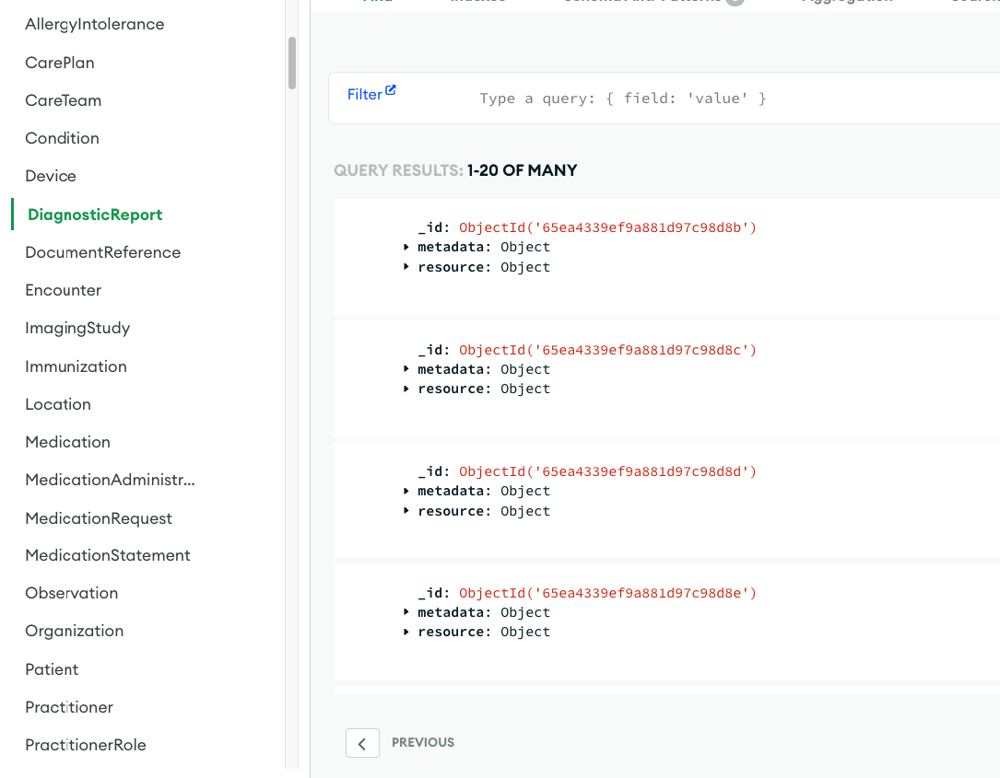
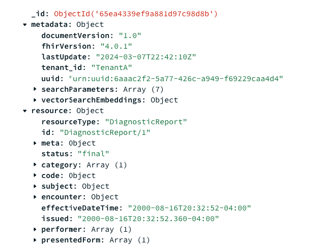

# Synthea FHIR Data to MongoDB

## Overview

This project processes and enriches healthcare data extracted from the Synthea dataset, focusing on breast cancer patient records over a 10-year span. The workflow involves four main Python scripts that split JSON bundles into separate NDJSON files, update references, enrich metadata for better analysis and interoperability, and upload the enriched data to MongoDB. AI embeddings for selected fields are also generated and added as part of the metadata, enhancing the dataset's utility for semantic search and RAG (Retrieval-Augmented Generation) applications.

## Installation

### Prerequisites

- Python 3.8 or higher
- pip (Python package manager)
- MongoDB server or cluster (local or cloud-based, such as MongoDB Atlas)

### Steps

1. Clone this repository to your local machine:
   ```
   git clone <repository-url>
   ```
2. Navigate into the cloned repository directory:
   ```
   cd path/to/cloned/repository
   ```
3. Install required Python libraries:
   ```
   pip install pymongo python-dotenv certifi openai
   ```

## Dataset Preparation

You'll need the Synthea dataset for approximately 2,000 patient records with 10 years of medical history to use this project.

### Downloading and Extracting the Dataset

1. Download the dataset zip file from [Synthea Dataset - Approx. 2,000 Patient Records](https://mitre.box.com/shared/static/13ypa62hpnnb3j67wdfmd4dd2tzzf18s.zip).
2. Unzip the downloaded file.
3. Move the extracted folder to the `Dataset` directory at the root of this project. Ensure the folder is named `originalResources`.

## Usage

### Stage 1: Split Bundles and Map New References

Splits JSON bundles into separate NDJSON files and maps new references.
```
python Stage1-splitBundlesAndMappingNewReferences.py
```

Note that this process also generates a file named uuid_to_url_mapping.json which contains the mappings from the original uuid's to new generated urls. 

### Stage 2: Update References for All Resources

Updates references within each resource after Stage 1 processing.
```
python Stage2-updateReferencesForAllResources.py
```

### Stage 3: Enrich Metadata

Enriches metadata for each resource, adding AI embeddings for selected fields.
```
python Stage3-enrichMetadata.py
```
Note that you can adapt the metadata you need, as well the search parameters for each resource type.
Additionaly you can setup which resource types contain unstructured data from which you would like to generate an AI embedding.
Current code limits to 25 embeddings. Adjust this to your necessity, and OpenAI credits. 

### Uploading to MongoDB

Uploads the enriched NDJSON files to MongoDB collections.

```
python Stage4-uploadToMongoDB.py
```

Your resulting resources will look like this:





## Additional Notes

- **Environment Variables**: Use a `.env` file at the project's root to store sensitive information:
  ```
  OPENAI_API_KEY="your_openai_api_key"
  MONGODB_CONNECTION_STRING='your_mongodb_connection_string'
  DATABASE='your_database_name'


## Contributions

Contributions and suggestions are welcome! Please open an issue or pull request for any improvements or issues encountered.
